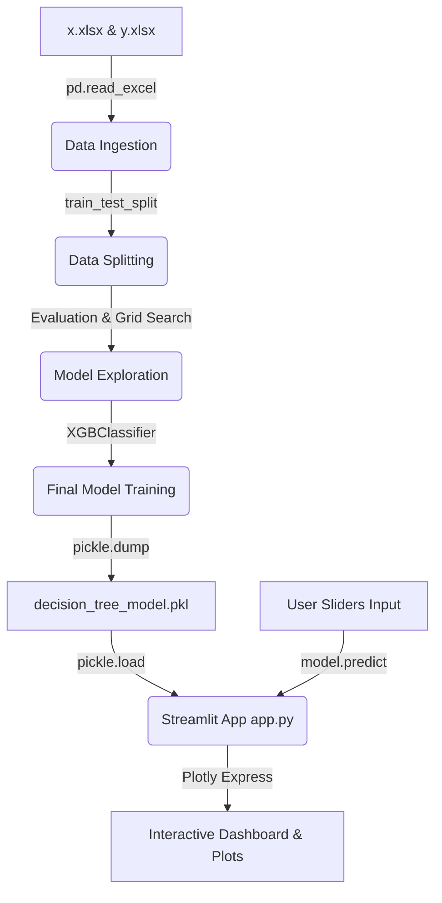

# Cosmic Classifier: Planetary Habitability Explorer

A personal machine learning project designed to preprocess planetary attributes and classify planets into habitability categories. This repository contains the complete model exploration pipeline and an interactive, space-themed Streamlit dashboard for real-time inference.

---

## Technology Stack and Libraries Used

This project utilizes a modern Python-based data science and frontend stack:

* **Frontend & Dashboard:** `streamlit` (utilizes HTML injections and Custom CSS for styling)
* **Interactive Visualization:** `plotly` (used to generate dynamic feature distribution radar and bar charts)
* **Model Algorithms & Frameworks:** `xgboost` (final gradient boosted model), `scikit-learn` (for data splitting, baseline model comparison, and metric evaluations)
* **Core Data Handling:** `pandas` (loading/processing Excel files), `openpyxl` (pandas engine for Excel reading), `numpy` (numeric computation)
* **Model Serialization:** `pickle` (for saving and loading the trained classifier)

---

## Pipeline and Working Workflow

Below is the step-by-step breakdown of how the data flows from raw files to live predictions, specifying what tools were used and where they are implemented:



### 1. Data Ingestion & Loading
* **Where:** `model.ipynb` (Cell 4)
* **What & How:** 
  * The dataset is split across two Excel files: `x.xlsx` contains the 10 planetary attributes for 33,175 entries, and `y.xlsx` contains the target labels `Prediction` (coded as integer categories `0` through `9`).
  * Loaded using `pandas` and the `openpyxl` engine:
    ```python
    x_df = pd.read_excel("x.xlsx")
    y_df = pd.read_excel("y.xlsx")
    ```

### 2. Data Splitting (Train/Test Partition)
* **Where:** `model.ipynb` (Cell 7)
* **What & How:**
  * Uses Scikit-learn's `train_test_split` helper to partition the features (`X`) and target labels (`y`).
  * Split configured as **80% training set** and **20% validation set**.
  * `stratify=y` is utilized to ensure the target class distributions remain equal across splits, and `random_state=42` is set for reproducibility.

### 3. Baseline Model Exploration & Metrics
* **Where:** `model.ipynb` (Cells 8 to 18)
* **What & How:**
  * Evaluated baseline classification architectures including **Logistic Regression**, **Decision Tree Classifier**, **Random Forest Classifier**, and **AdaBoost**.
  * Model evaluation metrics calculated using scikit-learn metrics:
    * **Accuracy Score (`accuracy_score`)**
    * **F1-Score (`f1_score` with average='weighted')**
    * **Precision Score (`precision_score`)**
    * **Recall Score (`recall_score`)**
    * **ROC-AUC Score (`roc_auc_score` with multi_class='ovr')**

### 4. Final Model Training & Optimization
* **Where:** `model.ipynb` (Cell 19)
* **What & How:**
  * Selected **XGBoost Classifier (`XGBClassifier`)** as the final estimator.
  * Achieved **99.75% training accuracy** and **91.44% test accuracy** on the validation set.
  * Fitted on the features using the standard scikit-learn compatible fit api:
    ```python
    dt_classifier = XGBClassifier()
    dt_classifier.fit(X_train, y_train)
    ```

### 5. Model Serialization (Saving)
* **Where:** `model.ipynb` (Cell 19)
* **What & How:**
  * Serialized the fitted classifier model object into a binary pickle format using Python's built-in `pickle` library:
    ```python
    with open("decision_tree_model.pkl", "wb") as model_file:
        pickle.dump(dt_classifier, model_file)
    ```

### 6. Dashboard Deployment & Live Inference
* **Where:** [app.py](file:///e:/Projects/cosmic_classifier/app.py) and the `src/` modules
* **What & How:** 
  * **Model Loading:** The Streamlit dashboard loads the pickle file using cached decorators in [model_utils.py](file:///e:/Projects/cosmic_classifier/src/model_utils.py).
  * **User Interface:** Collects real-time input parameters via 10 custom-styled sliders inside categorized tabs in [views.py](file:///e:/Projects/cosmic_classifier/src/views.py).
  * **Interactive Graphs:** Utilizes `plotly` to render a normalized signature radar chart and a horizontal bar chart of the parameter metrics in [charts.py](file:///e:/Projects/cosmic_classifier/src/charts.py).
  * **Real-time Prediction:** Feeds the slider values into a pandas DataFrame and executes predictions on the fly:
    ```python
    prediction = model.predict(input_df)
    ```
    Renders results inside custom prediction cards styled with glowing status boundaries.
  * **Export Capabilities:** Enables exporting parameter telemetry data as a CSV download link in [views.py](file:///e:/Projects/cosmic_classifier/src/views.py).

---

## Project Directory Structure

```text
cosmic-classifier/
│
├── src/                    # Modular source code package
│   ├── __init__.py         # Package initialization
│   ├── styles.py           # CSS themes and JavaScript injections
│   ├── charts.py           # Plotly graph definitions (radar & bar charts)
│   ├── model_utils.py      # Cached model loader and prediction formatting
│   └── views.py            # Page rendering views (Welcome, Inputs, Report)
│
├── app.py                  # Streamlit entry point and navigation coordinator
├── model.ipynb             # Jupyter Notebook containing the full training pipeline
├── decision_tree_model.pkl # Trained and exported XGBoost classifier model binary
├── x.xlsx                  # Inputs dataset containing planetary characteristics
├── y.xlsx                  # Outputs dataset containing target planet classes (0-9)
├── requirements.txt        # Configured dependencies list (for pip install)
└── README.md               # Detailed project documentation (this file)
```

---

## Running the Project Locally

### Step 1: Install Dependencies
Install all package requirements listed in [requirements.txt](file:///e:/Projects/cosmic_classifier/requirements.txt):
```bash
pip install -r requirements.txt
```

### Step 2: Start the Web Dashboard
Execute the Streamlit application command:
```bash
streamlit run app.py
```

Access the local server URL (usually `http://localhost:8501`) in your web browser to explore and test the dashboard interactively.
